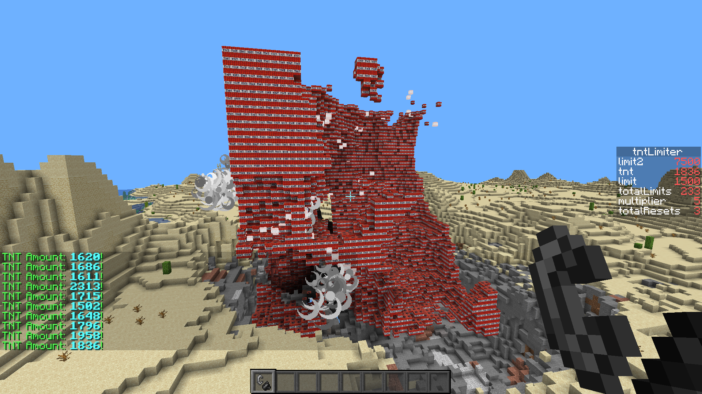

# LimitTNT
 LimitTNT is a simple datapack to protect your server from TNT lag.

**How to use:**

1. Install the datapack

2. The datapack is now fully working! But you may also like to change the settings.

**How to change settings:**

​	All settings are stored inside the objective `tntLimiter`.

​	`limit`  is a soft limit, when reached, only 750 TNTs will get killed. This means that the explosion *should* still continue.

​	**NOTE: Setting the `limit` value lower than 750 will kill all TNTs when the limit is reached** 

​	`limit2` is a hard limit, when reached, **ALL** TNTs will get killed.

​	**NOTE: You cannot change this value directly, modify the `multiplier` value instead**  

​	`multiplier` is a multiplier of the hard limit, `limit * multiplier = limit2`

​	**TIP: If you want to turn off the hard limit completely, change the multiplier value to a high number**

Players with the `tntDebug` tag will get notified when a limit is reached.

